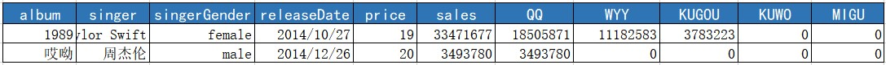

# Visualization of Chinese digital album sales
## Introduction

​	With the rapid development of electronic products, the music industry has also came into a new era: digital music. For a long time, Chinese are used to listen all songs for free, they have no awareness of paying for music. But in the recent years, led by top singers and many music platforms, listeners began to accept a new form of payment: digital albums. It’s a quiet huge market that developed with amazing speed.

​	In this project, we will use two graphs to visualize respectively the general and detailed information of Chinese digital album sales from 2014 to 2020. 

​	As for the visualization tool, we will use css, html, js and the library vega-light. 

## Data

### Data presentation

​	The dataset is downloaded from the site [数字专辑销售数据](http://y.saoju.net/szzj/) . This dataset contains information of all Chinese digital albums from 1980. For each album, we have the album name, the singer name, the singer gender, the release date, the album price, the sales and the proportion of sales in 5 different music platforms (QQ, WYY, KUGOU, KUWO, MIGU). Figure 1 is a presentation of the original data.

###Data pre-processing

In order to do the visualization, we need to pre-process the data.

####Filter the data

 	First of all, we filter the data by release date, to get the album which released after 2014. Then in order to get a reasonable scale, we exclude the extreme data. We filter the data by album price to get the album with price under 30 CYN, and filter the data by sales to get the album with sales bigger than 100 CYN.

#### Calculate cumulative sales

 	In order to draw an area chart of the total digital album sales from 2014 to 2020, we need to calculate the cumulative sales. We use the "window" method in vega-light to do the transformation. Figure 2 is a presentation of data with cumulative sales.

#### Fold platforms

 	In order to draw an line chart of the sales change in different music platforms, we need to fold the sales of different platforms and calculate the corresponding cumulative sales. We use the "fold" and "window" methods in vega-light to do the transformation. Figure 3 is a presentation of data with folded platforms.

## Graph of general information

​	In order to take an overview of the digital album sales change, We draw a box plot of the sales grouped by release year. We use a sequential color scheme to show the number of albums released each year, which is an quantitative attribute here.

​	As the scale of sales is large, we can toggle between linear and log scale for the y axis.

​	From the box plot, we can see that the number of albums increases, whereas the mean of sales decrease and the variation of sales becomes larger. That's because at past, the digital album market is small, only famous singers dare to release digital albums, which make the mean sales high. With the development of the market, more and more artists began to release digital albums, so the variation of sales became larger and the mean of sales decrease.

## Graph of detailed information

​	Then we start to look at more detailed information by drawing an interactive scatter plot of all the digital albums. The graph has multiple views: the main scatter plot of the digital albums by release date and sales; the tick chart on the left which plots sales of all the albums on the y axis; the area chart on the bottom which shows the change of total sales; the bar chart on the right which shows the proportion of sales in different music platforms.

###Scatter plot of digital albums

​	We draw a scatter plot of digital albums by release date and sales. We use shape to embed the singer gender since it's a nominal attribute. We use red sequential color scheme to embed the price of albums since it's a quantitative attribute. At the right-bottom of the view, I add a text to show the total count of albums displayed in the scatter plot.

###Tick plot of digital albums

​	On the left of the main scatter plot, we draw a tick plot of digital albums. The color embedding is the same as in the scatter plot to keep the consistency. 

​	This plot shows the general distribution of digital album sales. We can use it to select the interval of sales to be shown in the main plot.

###Area chart of cumulative sales

​	On the bottom of the main scatter plot, we draw an area chart of total sales from 2014 to 2020. We add a layer to draw lines that represent total sales in different music platforms. 

​	This chart shows the change of total digital album sales over time. We can use it to select the interval of release date to be shown in the main plot.

### Bar chart of proportion of sales in different music platforms

​	On the right of the main scatter plot, we draw a bar chart to represent the proportion of sales (of the albums displayed in the main plot) in different music platforms. We use categorical colors to embed the different music platforms. The color embedding is the same as in the area plot to keep the consistency. We also add texts on each bar to indicate the sales number.

## Interaction

There are many interactions we can do with this graph:

* Filter data by singers.
* Select the albums in one year to display.
* Toggle the scale of sales between log and linear.
* Select the interval of sales by brushing in the tick plot.
* Select the interval of release date by brushing in the area plot.
* Hover on an album to show the detailed information about this album, the hovered album will be highlighted by augmenting its size.
* Click to select a single album, other albums will be then turn to gray. The bar plot will show the proportion of sales in different music platforms of this album.

## Insight

​	From the graph, we can find out that the number of albums increases largely and the variation becomes larger. An album with higher sales often has a higher price. What's more, there are much more male singers than female singers. The most powerful music platform is QQ.

​	On using the interactions, we can find out more results that are quite interesting. For example, as shown in Figure below, all the albums whose sales are bigger than 50 millions are released after 2019. Which can show the development of the digital album market. 

